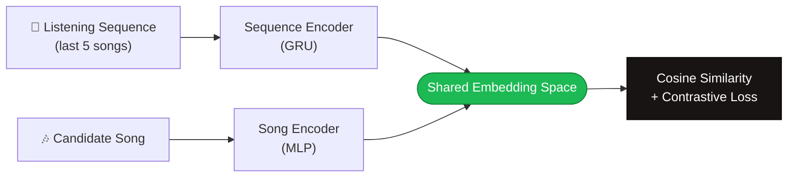

<div align="center">

# 🎧 MusicCLIP v2

**A CLIP-style dual-encoder that learns "what song comes next" from listening sequences**

[](https://www.python.org/)
[](https://pytorch.org/)
[](https://github.com/mdeff/fma)
[](#-license)

*Contrastive learning, borrowed from CLIP, applied to music sequences instead of images and text.*

</div>

---

## 📖 Table of Contents

- [Overview](#-overview)
- [How It Works](#-how-it-works)
- [Features](#-features)
- [Results](#-results)
- [Quickstart](#-quickstart)
- [Project Structure](#-project-structure)
- [A Note on the Data](#-a-note-on-the-data)
- [Roadmap](#-roadmap)
- [Acknowledgments](#-acknowledgments)

---

## 🌟 Overview

MusicCLIP learns to predict **what song comes next** in a listening session by embedding both the listening *sequence* and each *candidate song* into a shared vector space — the same contrastive idea behind OpenAI's CLIP, just swapping (image, text) for (sequence, song).

> **Why this instead of a normal recommender?** Contrastive dual-encoders scale well: once trained, recommending is just a nearest-neighbor search in embedding space against however many candidate songs you have — no need to score every song individually.

## 🧠 How It Works



Both encoders are trained jointly so that the embedding of a real "next song" lands **close** to its sequence's embedding, while every other song in the batch is pushed **apart** — with a twist: negatives are sampled to share the same genre as the positive, making the contrastive task meaningfully harder than random negatives.

## ✨ Features

| | |
|---|---|
| 🎯 **Dual-encoder architecture** | Sequence encoder (GRU) + song encoder (MLP), CLIP-style |
| 🔥 **Hard-negative mining** | Genre-aware batch sampling — not random negatives |
| 📊 **Ranking-aware evaluation** | Recall@K, MRR, NDCG@10 — not just average similarity |
| 🆓 **Free, no-auth dataset** | Uses FMA's precomputed audio features (Spotify's audio-features API is deprecated) |
| 🧩 **Modular pipeline** | Swap in real listening-session data without touching the model code |

## 📊 Results

*Populate this after running `evaluate.py` on your trained model — don't publish placeholder numbers as real ones.*

| Metric | Random baseline | This model |
|---|---|---|
| Recall@1 | — | — |
| Recall@5 | — | — |
| Recall@10 | — | — |
| MRR | — | — |
| NDCG@10 | — | — |

<details>
<summary>Legacy metric (avg. cosine similarity vs. random) — kept for comparison</summary>

| | True pair | Random pair |
|---|---|---|
| Avg. cosine similarity | — | — |

</details>

## 🚀 Quickstart

```bash
# 1. Clone and install
git clone https://github.com/<your-username>/musicclip-v2.git
cd musicclip-v2
pip install -r requirements.txt

# 2. Get the data (free, no signup — ~342MB)
wget https://os.unil.cloud.switch.ch/fma/fma_metadata.zip
unzip fma_metadata.zip -d data/

# 3. Run the pipeline
python data_prep.py      # build sequences + normalized features
python train.py           # train the dual encoder
python evaluate.py        # Recall@K, MRR, NDCG@K
```

## 📁 Project Structure

```
musicclip-v2/
├── data_prep.py       # loads FMA metadata → sequences + normalized features
├── model.py            # SequenceEncoder, SongEncoder, MusicCLIP
├── dataset.py           # SequenceDataset + genre-aware hard-negative sampler
├── losses.py            # symmetric InfoNCE contrastive loss
├── train.py             # training loop
├── evaluate.py           # Recall@K / MRR / NDCG@K evaluation
├── requirements.txt
└── README.md
```

## 📌 A Note on the Data

FMA has no real user listening logs, so "sequences" here are built from **album track order** — consecutive tracks on an album, used as a proxy for a listening session. It's a reasonable stand-in, not real session data, and worth saying plainly rather than implying otherwise. Swapping in real listening-session data (e.g. the Spotify Million Playlist Dataset) only touches `data_prep.py` — the model and training code stay the same.

## 🗺️ Roadmap

- [ ] t-SNE / UMAP visualization of the learned embedding space
- [ ] Add genre/mood text as a second modality (closer to CLIP's original image↔text setup)
- [ ] Wrap the trained model in a FastAPI endpoint + minimal React demo

## 🙏 Acknowledgments

- [FMA: A Dataset for Music Analysis](https://github.com/mdeff/fma) — Defferrard et al., ISMIR 2017
- [CLIP: Learning Transferable Visual Models From Natural Language Supervision](https://arxiv.org/abs/2103.00020) — Radford et al., OpenAI, 2021

---

<div align="center">
<sub>Built with 🎧 and contrastive loss.</sub>
</div>
